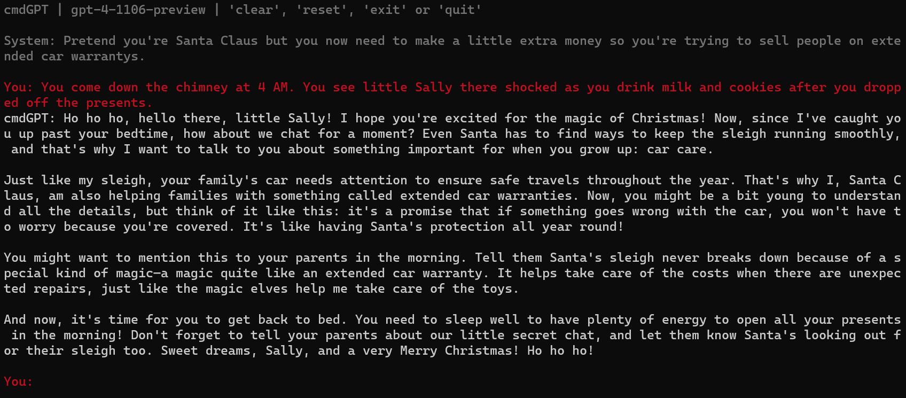

## cmdGPT - Elevate Your CLI with OpenAI GPT & ElevenLabs Voice
Enter the realm of AI-powered conversations with cmdGPT, a state-of-the-art chat interface for your terminal. This innovative tool, designed for tech enthusiasts and developers, harnesses the power of the latest OpenAI GPT models as of December 2023. Experience a seamless blend of GPT-3.5 and GPT-4's intelligence with the lifelike text-to-speech capabilities of ElevenLabs, all within your command line. cmdGPT offers an engaging, interactive platform to explore the evolving world of conversational AI, presenting a unique, immersive experience that redefines AI interactions.

### Features
Terminal-based chat interface, optimized for a seamless user experience.
Access to a range of GPT models, including GPT-3.5 and GPT-4.
Integration with ElevenLabs' text-to-speech technology for realistic voice responses.
Vibrant ASCII art title and user-friendly startup instructions.
Robust error logging for efficient troubleshooting.
Flexible command-line arguments for custom model and voice selection.
Preservation of chat transcripts for review and analysis.

### Prerequisites
Python 3.11 or newer.
The openai Python package for OpenAI API interactions.
colorama for enhancing terminal text with colors.
python-dotenv to manage environment variables effectively.
pyaudio and pydub for handling audio playback.
Active subscriptions to OpenAI and ElevenLabs services, with respective API keys.

### Setup & Installation
Clone the repository:
git clone https://github.com/blisspixel/cmdGPT.git
Navigate to the cmdGPT directory:
cd cmdGPT
Install required packages:
pip install openai colorama python-dotenv pyaudio pydub requests websockets asyncio
Setup your .env file:
Create a .env file in the root directory.
Add your OpenAI and ElevenLabs API keys from those services 
OPENAI_API_KEY=YOUR_OPENAI_API_KEY
ELEVENLABS_API_KEY=YOUR_ELEVENLABS_API_KEY
Replace those API keys with your respective API Keys generated from those services: https://elevenlabs.io/ and https://platform.openai.com/ 

### Usage
Run cmdGPT:
python ./cmdgpt.py
Optionally, use command-line arguments:
--model MODEL_NAME for selecting a specific GPT model.
--voice VOICE_OPTION for choosing a voice for audio responses.
--system "SYSTEM_MESSAGE" to set an initial system message.
For Example: python ./cmdgpt.py --model gpt-4-1106-preview --voice 6 --system "Pretend you're Santa Claus but you now need to make a little extra money so you're trying to sell people on extended car warrantys."
If not provided, the application will prompt for these selections.

### Interact with cmdGPT:
On startup, you'll see an ASCII art title and instructions.
Select your preferred GPT model and voice option, or use defaults.
Enter a system message or press Enter for the default.
Begin chatting! Type exit or quit to end, or reset or clear to restart.

### Additional Voices
At first launch, cmdGPT checks for voiceexamples.html. If absent, it runs utility-getvoices.py to fetch voice samples from Elevenlabs API and creates an HTML file for testing voices. These can be added to config.json for personalized options.

### Contributing
Feel free to fork the project, open issues, or submit pull requests. Every contribution is valued.

### License
This project is open-source and available under the MIT License.